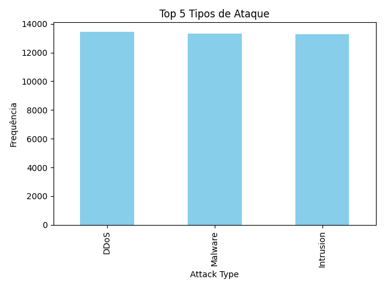

# Relatório Executivo: Panorama de Ameaças e Ações Prioritárias de Segurança

**Data:** 26 de Outubro de 2023
**Para:** Conselho Administrativo e Liderança Executiva
**De:** [Seu Nome/CISO Office]
**Assunto:** Análise do Panorama de Ameaças e Recomendações Estratégicas Urgentes

---

## 1. Resumo Executivo

Este relatório apresenta uma análise crítica do panorama de ameaças cibernéticas enfrentado pela organização, com base nos dados de alertas técnicos agregados. O volume de 40.000 alertas em um período recente indica uma pressão significativa e contínua sobre nossa infraestrutura de segurança. Os vetores de ataque dominantes – DDoS, Malware e Intrusão – representam riscos substanciais para a disponibilidade, integridade e confidencialidade de nossos ativos. A ausência de dados de geolocalização para as origens dos ataques é uma lacuna crítica que impede uma inteligência de ameaças mais granular e a implementação de defesas geo-específicas.

São propostas três ações prioritárias estratégicas para mitigar esses riscos e fortalecer nossa postura de segurança.

## 2. Análise do Panorama de Ameaças

### 2.1. Volume Total de Alertas

Registramos um volume total de **40.000 alertas** no período analisado. Este número elevado sublinha a persistência e a escala das tentativas de ataque, demandando uma revisão contínua e aprimoramento de nossas capacidades de detecção e resposta. É imperativo que avaliemos a eficácia de nossos controles existentes e a saturação de nossos times de segurança frente a tal volume.

### 2.2. Vetores de Ataque Dominantes

A análise dos alertas revela os três principais vetores de ataque que atualmente representam as maiores ameaças:

*   **DDoS (Distributed Denial of Service):** 13.428 ocorrências
*   **Malware:** 13.307 ocorrências
*   **Intrusão:** 13.265 ocorrências

Estes vetores, com volumes de ocorrências notavelmente próximos, indicam uma estratégia de ataque diversificada e persistente contra a organização. Ataques DDoS visam a disponibilidade dos serviços, Malware busca comprometer sistemas e dados, e tentativas de intrusão buscam acesso não autorizado a redes e informações sensíveis.

*Figura 1: Gráfico demonstrando os três principais vetores de ataque por volume de ocorrências.*

### 2.3. Origem Geográfica dos Ataques

É com preocupação que observamos a **indisponibilidade de dados de geolocalização** para as origens dos ataques. Esta lacuna impede uma compreensão mais aprofundada dos atores das ameaças e de suas geografias de operação, limitando nossa capacidade de implementar defesas baseadas em inteligência geoespacial e de priorizar recursos de forma estratégica. A obtenção e análise desses dados é crucial para uma defesa proativa.

*Figura 2: Mapa ilustrativo para a distribuição geográfica de ataques. **Nota:** Os dados de origem geográfica não estavam disponíveis para esta análise. A inclusão de tais dados é uma prioridade para relatórios futuros.*

## 3. Avaliação de Riscos

Com base na análise, os principais riscos são:

*   **Risco à Disponibilidade (DDoS):** A alta incidência de ataques DDoS pode resultar em interrupções significativas de serviço, impactando operações críticas, reputação e perdas financeiras.
*   **Risco à Integridade e Confidencialidade (Malware & Intrusão):** A prevalência de malware e tentativas de intrusão eleva o risco de comprometimento de sistemas, vazamento de dados sensíveis, roubo de propriedade intelectual e fraudes.
*   **Risco de Cegueira Estratégica:** A falta de dados de geolocalização nos impede de identificar padrões geográficos de ataque, implementar bloqueios regionais eficazes e aprimorar nossa inteligência de ameaças para antecipar futuras ofensivas. Isso limita nossa capacidade de tomar decisões de segurança baseadas em dados contextuais.

## 4. Recomendações Estratégicas Prioritárias

Para enfrentar o panorama de ameaças e mitigar os riscos identificados, propomos as seguintes três ações estratégicas prioritárias:

### Ação Prioritária 1: Fortalecimento da Defesa Contra Vetores Críticos

*   **Medidas:**
    *   **DDoS:** Implementar ou otimizar soluções de mitigação de DDoS em camadas (rede e aplicação), incluindo provedores de scrubbing de tráfego. Realizar testes de estresse periódicos para validar a resiliência.
    *   **Malware:** Reforçar defesas de endpoint com EDR (Endpoint Detection and Response), expandir o uso de sandboxing e aprimorar as capacidades de análise de inteligência de ameaças para detecção proativa de novas variantes.
    *   **Intrusão:** Intensificar monitoramento de rede (NDR - Network Detection and Response), realizar varreduras de vulnerabilidades e testes de penetração regulares, e fortalecer políticas de controle de acesso (MFA, Zero Trust).
*   **Objetivo:** Reduzir a superfície de ataque e a probabilidade de sucesso dos vetores mais prevalentes.

### Ação Prioritária 2: Melhoria da Visibilidade e Inteligência de Ameaças

*   **Medidas:**
    *   **Coleta de Dados de Geolocalização:** Priorizar a integração de fontes de dados que forneçam informações precisas sobre a geolocalização de IPs de origem de ataques. Isso pode envolver aprimoramento de logs, uso de serviços de inteligência de ameaças ou soluções de firewall/IPS com capacidades de geo-blocking.
    *   **Correlação de Eventos:** Aprimorar as capacidades do nosso SIEM/SOAR para correlacionar alertas não apenas por tipo, mas também por origem geográfica, hora e alvos, criando um panorama mais coerente das campanhas de ataque.
    *   **Relatórios Personalizados:** Desenvolver painéis e relatórios que permitam a visualização rápida e estratégica da origem dos ataques, facilitando a tomada de decisão em tempo real.
*   **Objetivo:** Eliminar a cegueira estratégica, fornecendo inteligência acionável para defesas mais precisas e proativas.

### Ação Prioritária 3: Otimização da Resposta a Incidentes e Proatividade

*   **Medidas:**
    *   **Playbooks Específicos:** Desenvolver e testar playbooks detalhados para resposta a incidentes de DDoS, Malware e Intrusão, garantindo que as equipes saibam como agir rapidamente e de forma coordenada.
    *   **Exercícios de Simulação:** Conduzir exercícios de simulação de resposta a incidentes (tabletop exercises e simulações completas) para validar a eficácia dos playbooks e treinar as equipes.
    *   **Caça a Ameaças (Threat Hunting):** Implementar uma função de caça a ameaças para buscar ativamente indicadores de comprometimento que possam ter passado despercebidos pela detecção automatizada, focando nos vetores de ataque identificados.
*   **Objetivo:** Reduzir o tempo médio de detecção e resposta (MTTD/MTTR), minimizando o impacto de incidentes de segurança.

## 5. Conclusão

O volume e a natureza dos alertas de segurança exigem atenção imediata e investimentos estratégicos. Ao focar nas ações prioritárias de fortalecimento das defesas, aprimoramento da inteligência de ameaças e otimização da resposta a incidentes, podemos elevar significativamente nossa postura de segurança e proteger os ativos críticos da organização contra um cenário de ameaças em constante evolução.

Recomendo uma discussão urgente com o Comitê de Segurança para detalhar a implementação destas ações.

Atenciosamente,

[Seu Nome]
Chief Information Security Officer (CISO)